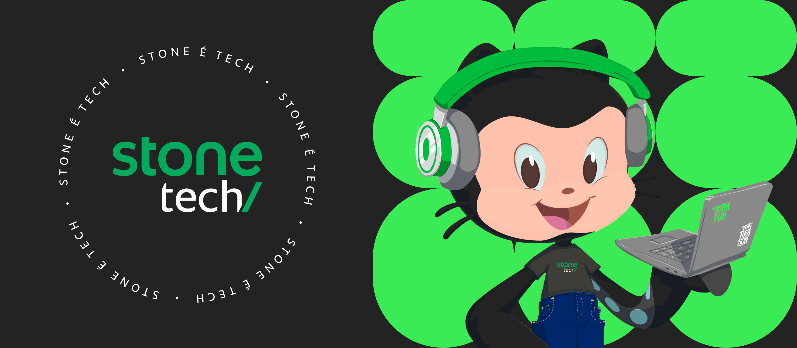

🇺🇸 We are preparing an incredible page for you who would like to know a little more about Stone Pagamentos.

🇧🇷 Estamos preparando uma página incrível para você que deseja conhecer um pouco mais sobre a Stone Pagamentos.

---

🇺🇸 If you are a Stone contributor and are looking for inside information, make sure you select the Members option on the right. [Click here](https://github.com/stone-payments?view_as=member) click here to be redirected.

🇧🇷 Se você é colaborador da Stone e está procurando informações internas verifique se selecionou a opção para Membros no canto direito. [Clique aqui](https://github.com/stone-payments?view_as=member) clique aqui para ser redirecionado.
